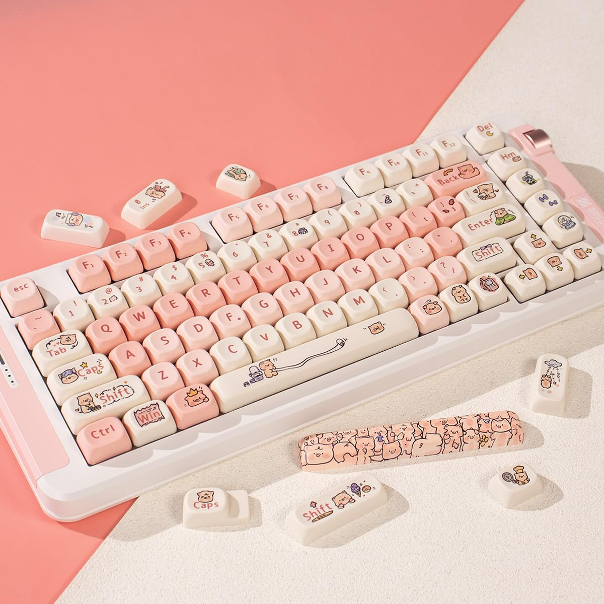
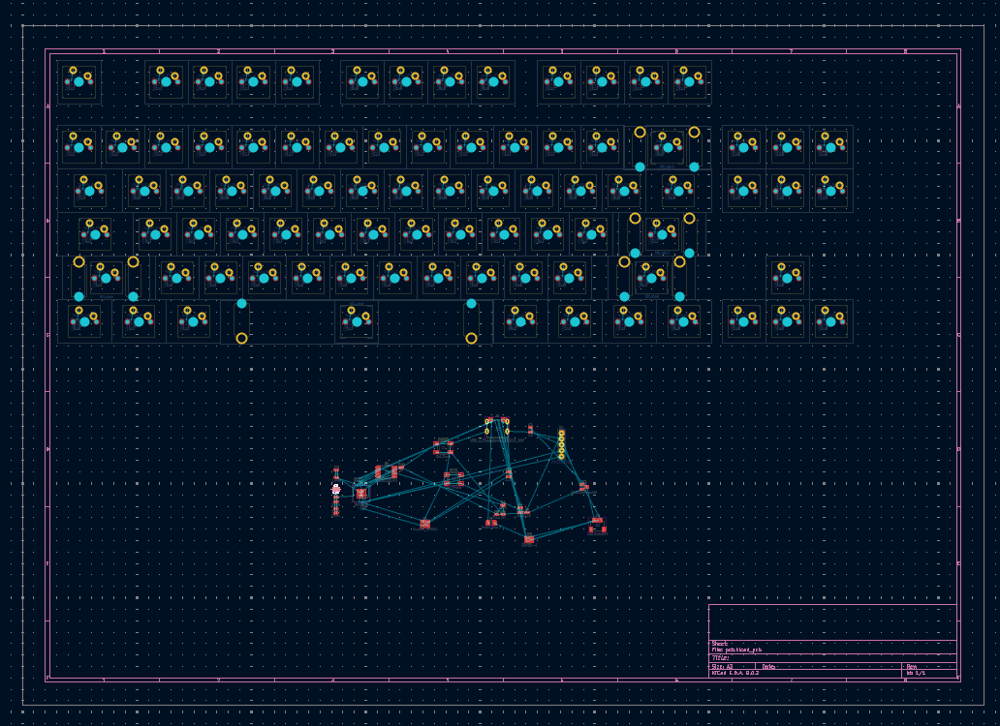
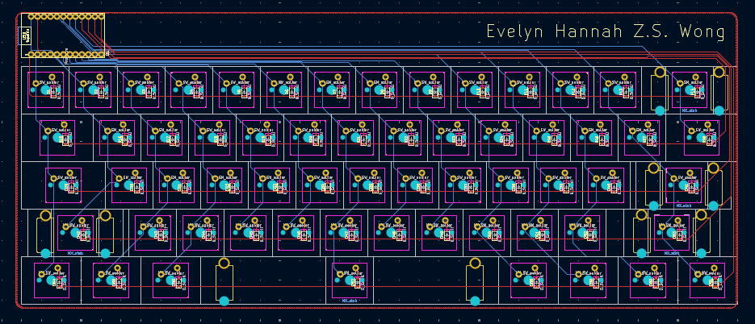

# June 18th 

## 1:51 PM
What's up reviewers! My physics exam is in 5 days and I really really really don't want to study so I'm gonna do all of this in like two days. I know I'm not suppposed to be rushing this and I'm supposed to have a "smaller, more consistent" journal for a "more realistic story" so I'm sorry in advance!

Anyway my goals for today:
- Figure out what parts I want to use for my keyboard
- Finish designing the PCB
- Hopefully finish designing the case
- Actually remember to journal

## 2:27 PM
who knew you can find this stuff on amazon
| part        | name                  | website                | cost (converted from cad to usd) |
|-------------|-----------------------|------------------------|----------------------------------|
| switches    | akko steller rose     | https://a.co/d/99Zb7yo | $49.69 for 90                    |
| keycaps     | pig keycaps!!!        | https://a.co/d/ibvI8kw | $22.94 for 131                   |
| stabilizers | costar mx stabilizers | https://a.co/d/9GnJFxL | $11.70 for 1 6u and 4 2u         |

this keyboard is totally gonna be for the girlies like can we take a moment and appreciate how cute these are:

## 3:10 PM
i forgot how to use kicad i'm crashing out.

anyway i added a timelapses folder so you can see that i'm actually working 

## 5:19 PM
i've been following this really good tutorial https://youtu.be/6Z49bynRqj8 and i'm losing my mind. 06-18_519PM vid is TWO HOURS OF TIMELAPSE 

## 8:26 PM
i finally figured out how to make a pcb 😭. why are keyboards so much more complicated than TEJ2O. anyway look at this!!! 4 hours of my life!!!

# June 20th

## 11:39 AM
i didn't forget about this i've been struggling to trace the pcb for the past 24 hours i have no idea what i'm doing i'll update this journal when i figure it out i'm losing my mind

# June 21st

## 8:52 PM
it has come to my attention i have severely overestimated myself and we're gonna be compeltely switching up!!!! 

well. the tutorial i was following has two parts and is supposed to have a part three. but it hasn't come out. so like. yeah. we are going to a basic 60% keyboard. much easier to wire. much easier for my mental health. i have the whole month to try and build a more complicated keyboard. so we're going to stick to the basics first. pro micro to make my life easier. i pinky swear i will make a tkl by the end of this though.

20 hours of my life bruh.

anyway yeah. how's that for documenting everything i do 😭

## 9:53 PM
I GOT IT! pcb is done now i have to waste my life doing cad. look at this though:
