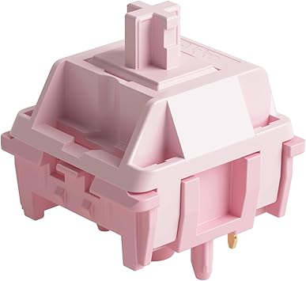
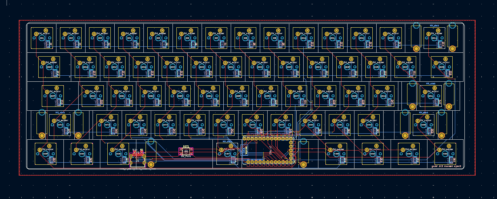
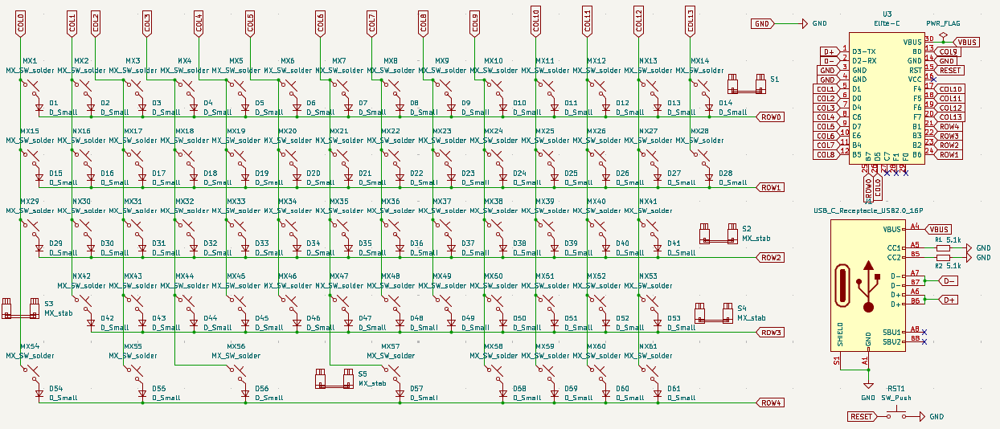

A description of what your project is
A couple sentences on why you made the project

# piggy keyboard!!!

## description
this is a super basic 60% keyboard with akko steller rose switches. it's completely custom: the pcb, cad, and plate files are all in here. 

## why i made it!
i've been talking about making a keyboard since the pandemic started but i am BROKE (that's a fancy way of saying i'm lazy) so when i found out i can do it all FOR FREE??? HELLO???? YES PLEASE??? 

## but uh...
bro initially i wanted to make this a tkl but tell me why kicad keybaord schematics are so difficult and for what??? like an rp2040 is NOT that complicated why am i struggling to trace capacitors. anyway. had to dumb it down. i hope i can make another tkl later. somebody please teach me how to proprely make pcbs.

## stfu ev show me the pictures
i gotchu

